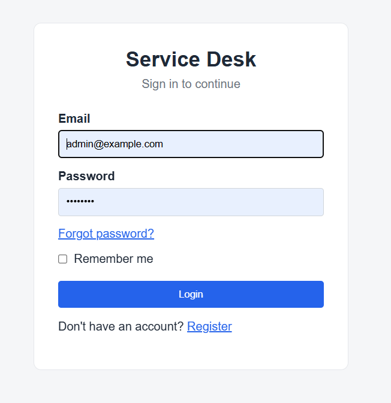
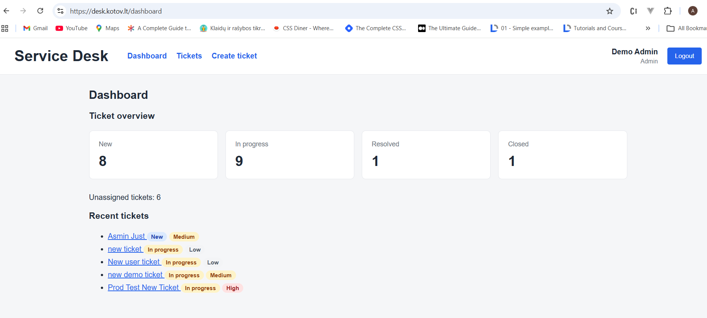
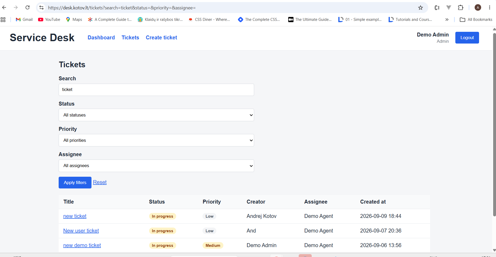
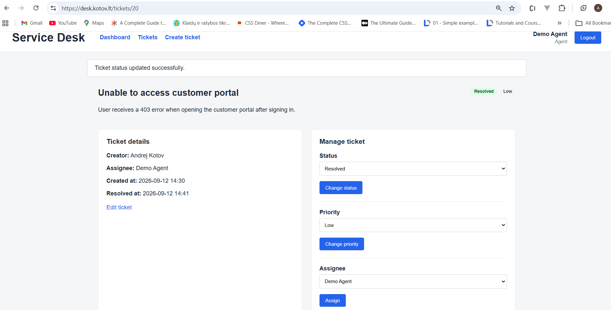
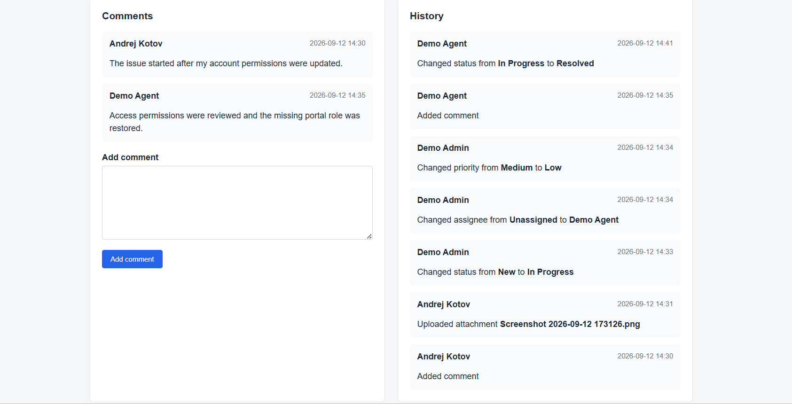
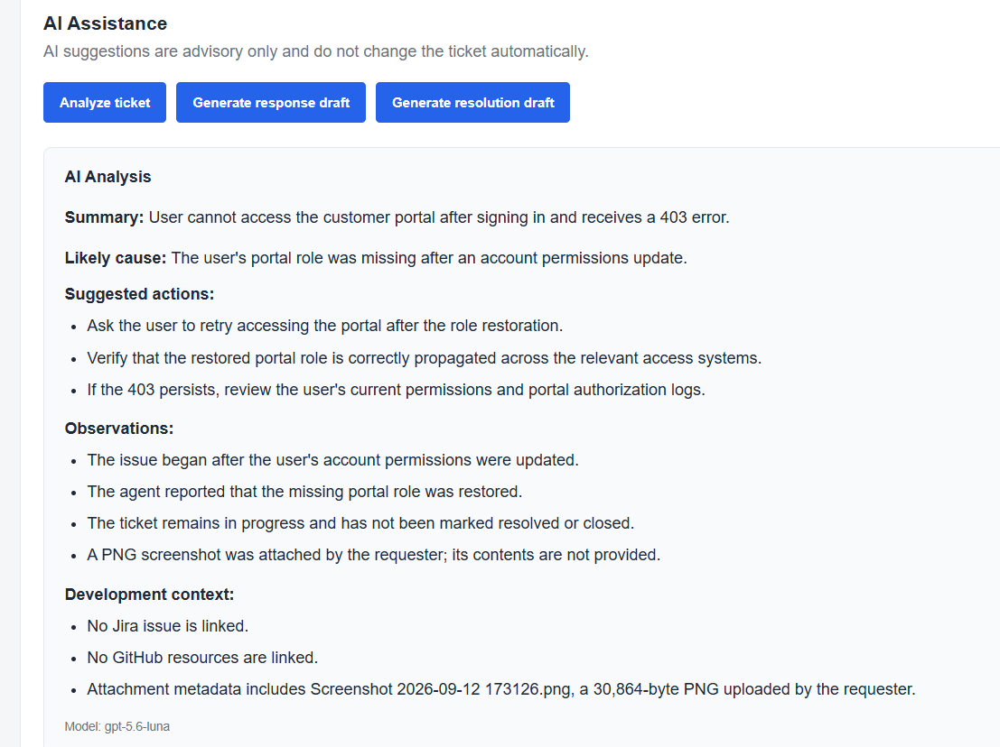
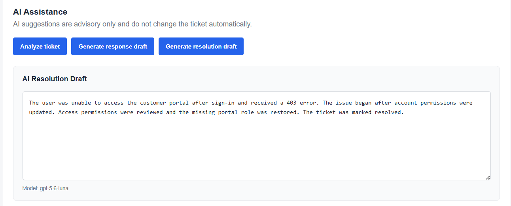

# Service Desk

Service Desk is a production-deployed Laravel support ticket management application built as a backend-focused portfolio project.

The application implements a complete support ticket workflow with role-based access control, assignment, comments, human-readable audit history, private attachments, queued notifications, REST API authentication, external Jira and GitHub integrations, GitHub webhooks, and AI-assisted ticket analysis and drafting.

External integrations and AI are optional. The core Service Desk workflow remains functional when they are disabled or unavailable.

## Live Demo

**Application:** https://desk.kotov.lt

Demo accounts:

| Role | Email | Password |
| --- | --- | --- |
| Requester | `requester@example.com` | `password` |
| Agent | `agent@example.com` | `password` |
| Admin | `admin@example.com` | `password` |

The public demo also supports self-registration, email verification, and password reset.



## What This Project Demonstrates

- Laravel application architecture with separated validation, authorization, business logic, and persistence concerns
- Role-based ticket workflow for Requester, Agent, and Admin users
- Ticket assignment, priorities, status transitions, comments, and private attachments
- Human-readable audit trail for workflow changes and ticket activity
- Queued transactional email notifications
- REST API secured with Laravel Sanctum
- Jira and GitHub integrations with asynchronous processing
- GitHub webhook handling and local synchronization of development context
- Pluggable OpenAI and Groq integration
- AI-assisted ticket analysis, response drafting, and resolution drafting
- Human-in-the-loop AI design where AI suggestions never modify privileged ticket state automatically
- Automated tests, Laravel Pint, GitHub Actions CI, and production deployment

## Application Demo

### Dashboard

The dashboard provides a quick overview of the current ticket workload, including ticket counts by status, unassigned tickets, and recent activity.



### Ticket List and Filtering

Authorized users can search the ticket queue and filter tickets by status, priority, and assignee.



### Ticket Workflow

Agents and administrators can manage ticket status, priority, and assignment. Workflow timestamps such as `resolved_at` are maintained by the application, while authorization policies restrict actions according to the user's role.



### Comments and Audit History

Ticket activity is recorded in a human-readable audit trail. History includes status, priority, and assignee changes as well as comment and attachment activity, together with the responsible user and timestamp.

Comment bodies remain in the Comments section and are not duplicated in History.



### AI Assistance

AI assistance uses the current Service Desk context, including ticket data, comments, history, synchronized development context, and attachment metadata.

In the example below, the ticket is still **In Progress**. The AI recognizes that the reported problem appears to have been fixed, but also observes that the workflow has not yet been marked as resolved.



An authorized user remains responsible for changing the workflow state. After the ticket is manually marked **Resolved**, AI uses the updated context when generating a resolution draft.



AI output is advisory only. It does not automatically change ticket status, priority, assignee, resolution, comments, or other privileged business state.

## Features

### Authentication and Access Control

- User login and logout
- Self-registration
- Email verification
- Password reset
- Role-based access control
- Requester, Agent, and Admin roles

### Ticket Management

- Ticket creation and editing
- Ticket status workflow
- Ticket priorities
- Ticket assignment and unassignment
- Ticket comments
- Human-readable ticket audit history
- Ticket filtering and search
- Dashboard with ticket statistics
- Soft deletion
- Private file attachments with authorized downloads

### Notifications

- Queued email notifications
- Ticket creation notifications
- Assignment notification to the assigned agent
- Assignment update notification to the ticket requester
- Status change notifications
- Priority change notifications
- Comment notifications
- Attachment notifications
- Resend API transport for production email delivery
- Mailtrap support for local email testing

### REST API

- Authenticated ticket API
- Laravel Sanctum Bearer-token authentication
- Token creation and revocation
- API rate limiting
- Shared validation, authorization, and business rules between web and API flows

### External Integrations

- Jira issue creation
- GitHub issue creation
- GitHub webhook processing
- Local synchronization of external resource metadata
- Queued integration jobs with retry handling
- Independent integration feature flags
- Finite HTTP connection and request timeouts

### AI Assistance

- Pluggable AI provider architecture
- OpenAI provider
- Groq provider
- Ticket context aggregation
- AI ticket analysis
- Suggested response drafts
- Suggested resolution drafts
- AI assistance directly in the ticket UI
- Attachment metadata included in AI context without exposing attachment contents
- Agent/Admin-only AI authorization

AI output is advisory only. AI does not autonomously change ticket status, priority, assignee, resolution, comments, or other privileged business state.

### Engineering and Production Readiness

- Automated feature and integration tests
- GitHub Actions CI
- PHP code style checks with Laravel Pint
- Production Vite asset build
- Fresh-database migration verification
- Production-safe demo data controls
- Laravel configuration, route, event, and view caching compatibility
- Persistent private attachment storage in production
- Dedicated queue worker
- HTTPS custom domain
- Production email delivery through Resend
- Production deployment checklist
- Security and architecture reviews

## Technology Stack

### Backend

- PHP 8.4.1+
- Laravel 13
- MySQL
- Eloquent ORM
- Laravel Fortify
- Laravel Sanctum
- Laravel Notifications
- Database queues
- Laravel HTTP Client

### Frontend

- Blade
- JavaScript
- Vite
- Node.js 22 in CI

### Development and Quality

- Laravel Sail
- Docker
- Composer
- PHPUnit
- Laravel Pint
- Faker
- Git
- GitHub
- GitHub Actions

### External Services

- Jira
- GitHub API
- GitHub Webhooks
- OpenAI
- Groq
- Resend
- Mailtrap for local email testing

## Architecture

The core application follows a layered structure:

```text
Web / API Controllers
        ↓
Form Requests
        ↓
Policies
        ↓
Application Services
        ↓
Eloquent Models
        ↓
Database
```

Main responsibilities:

- Controllers handle HTTP requests and responses.
- Form Requests handle validation and request authorization.
- Policies enforce role-based access control.
- Application services contain ticket workflow and notification logic.
- Eloquent models represent domain entities and relationships.
- Laravel Notifications handle queued email delivery.
- Queue jobs handle asynchronous external integration work.

External systems are kept outside the core ticket workflow:

```text
Service Desk
    │
    ├── Jira Integration
    │       └── Jira Issue
    │
    ├── GitHub Integration
    │       ├── GitHub Issue
    │       └── Webhook Events
    │
    └── AI Integration
            ├── OpenAI
            └── Groq
```

The Service Desk database remains authoritative for ticket workflow state.

Important architectural principles:

- external APIs are not called from domain models;
- integrations are independently configurable;
- secrets are provided through environment variables;
- retryable external work is queued;
- integration jobs are dispatched after database commit where required;
- external failures must not break the core Service Desk workflow;
- AI output is treated as untrusted advisory content;
- tests do not require real external credentials or network access.

Detailed integration architecture is documented in `docs/external-integrations-ai-architecture.md`.

## User Roles

### Requester

A requester can:

- create tickets;
- view their own tickets;
- edit permitted ticket information;
- comment on tickets they can access;
- upload and download permitted attachments;
- reopen their own resolved tickets.

### Agent

An agent can:

- view all tickets;
- edit ticket information;
- assign tickets to agents;
- change ticket priority;
- change ticket status;
- comment on tickets;
- manage permitted attachments;
- use AI assistance.

### Admin

An administrator has the ticket-management capabilities of an agent and can use privileged application functionality according to the configured policies.

## Ticket Workflow

Supported statuses:

```text
new
in_progress
resolved
closed
```

Main workflow:

```text
NEW → IN_PROGRESS → RESOLVED → CLOSED
```

A resolved ticket can be reopened:

```text
RESOLVED → IN_PROGRESS
```

When a ticket becomes resolved, `resolved_at` is populated.

When a resolved ticket is reopened, `resolved_at` is cleared.

When a ticket becomes closed, `closed_at` is populated.

## Ticket Priorities

Supported priorities:

```text
low
medium
high
urgent
```

The default priority is:

```text
medium
```

## Ticket History

Important ticket activity is stored in ticket history and displayed newest first.

Recorded activity includes:

- status changes;
- priority changes;
- assignee changes;
- comment creation;
- attachment uploads.

Workflow values are displayed with human-readable labels. Assignee changes display user names instead of raw database IDs, while useful identifiers remain preserved in the stored structured metadata.

Comment history records the activity without duplicating the comment body. Attachment history identifies the uploaded file by its original file name.

New assignee history records keep a name snapshot so the audit trail remains understandable if user data changes later. Legacy assignee records that contain only IDs are resolved in a single batch query when possible, avoiding N+1 lookups.

## Attachments

Users who are authorized to access a ticket can upload attachments.

Supported file types include:

```text
jpg
jpeg
png
pdf
txt
log
```

Maximum upload size:

```text
10 MB
```

Attachment metadata is stored in the database.

Attachment files are stored privately under Laravel's local filesystem:

```text
storage/app/private/ticket-attachments
```

Downloads are served through authorization-controlled application routes. The current attachment implementation does not require `php artisan storage:link`.

## Email Notifications

The application sends queued email notifications for important ticket events.

Supported notifications include:

- ticket creation;
- ticket assignment to the assigned agent;
- assignment updates to the ticket requester;
- ticket status change;
- ticket priority change;
- new ticket comment;
- new ticket attachment;
- account email verification;
- password reset.

The user who performs an action is not notified when the notification would be redundant. Reassigning a ticket to the same agent does not create a duplicate assignment notification.

Notifications are processed through Laravel's database queue and are configured to dispatch after the surrounding database transaction commits where required.

Production email is delivered through the Resend HTTP API. Mailtrap can be used for local SMTP testing.

## REST API

The Service Desk exposes an authenticated REST API for the core ticket workflow.

Ticket endpoints:

```text
GET    /api/tickets
POST   /api/tickets
GET    /api/tickets/{ticket}
PUT    /api/tickets/{ticket}
PATCH  /api/tickets/{ticket}/status
PATCH  /api/tickets/{ticket}/priority
PATCH  /api/tickets/{ticket}/assignee
POST   /api/tickets/{ticket}/comments
```

Authentication uses Laravel Sanctum Bearer tokens.

Token endpoints:

```text
POST   /api/tokens
DELETE /api/tokens/current
```

The API uses the same validation, authorization policies, workflow services, and business rules as the web interface.

Validation errors are returned as JSON with HTTP status `422`.

Unauthorized and forbidden operations return the appropriate HTTP status.

## Jira Integration

The Jira integration can create an external Jira issue from a Service Desk ticket.

Configuration is environment-driven and the integration can be disabled independently.

Example configuration:

```env
JIRA_ENABLED=false
JIRA_BASE_URL=
JIRA_EMAIL=
JIRA_API_TOKEN=
JIRA_PROJECT_KEY=
JIRA_ISSUE_TYPE_ID=
```

Jira requests use finite connection and request timeouts. Retryable failures are handled through queued integration jobs.

## GitHub Integration

The GitHub integration supports outbound issue creation and inbound webhook processing.

Example configuration:

```env
GITHUB_INTEGRATION_ENABLED=false
GITHUB_TOKEN=
GITHUB_REPOSITORY=
GITHUB_WEBHOOK_SECRET=
```

Webhook processing is asynchronous and external resource information is synchronized locally.

The GitHub integration is optional and does not own Service Desk ticket workflow state.

## AI Assistance

AI support is optional and provider-based.

Supported providers:

- OpenAI
- Groq

Example configuration:

```env
AI_ENABLED=false
AI_PROVIDER=openai

OPENAI_API_KEY=
OPENAI_MODEL=

GROQ_API_KEY=
GROQ_MODEL=openai/gpt-oss-20b
```

The AI layer can:

- analyze a ticket and its development context;
- generate a suggested response draft;
- generate a suggested resolution draft.

AI context can include ticket data, comments, history, synchronized development context, and attachment metadata.

Attachment file contents are not analyzed by the current implementation.

AI results are not automatically persisted as ticket comments or workflow changes. An authorized human remains responsible for reviewing and applying any suggestion.

## Installation

Clone the repository:

```bash
git clone <repository-url>
cd service-desk
```

Install PHP dependencies:

```bash
composer install
```

Create the environment file:

```bash
cp .env.example .env
```

Generate the application key:

```bash
php artisan key:generate
```

Start Laravel Sail:

```bash
./vendor/bin/sail up -d
```

Run migrations:

```bash
./vendor/bin/sail artisan migrate
```

Install frontend dependencies and build assets:

```bash
./vendor/bin/sail npm ci
./vendor/bin/sail npm run build
```

## Demo Data

Demo data is disabled by default so that known demo credentials cannot be accidentally introduced into an unintended production environment.

To recreate the local database with demo data, set:

```env
DEMO_DATA_ENABLED=true
```

Then run:

```bash
./vendor/bin/sail artisan migrate:fresh --seed
```

### Demo Accounts

All demo accounts use the password:

```text
password
```

Requester:

```text
requester@example.com
```

Agent:

```text
agent@example.com
```

Admin:

```text
admin@example.com
```

Do not enable these known demo credentials in a real production environment.

## Email Configuration

### Production with Resend

Production uses Laravel's Resend mail transport over HTTPS.

Example configuration:

```env
MAIL_MAILER=resend
RESEND_API_KEY=
MAIL_FROM_ADDRESS=noreply@your-domain.example
MAIL_FROM_NAME="${APP_NAME}"
QUEUE_CONNECTION=database
```

The production sender domain must be verified with Resend. API keys and other mail credentials must never be committed to source control.

### Local Testing with Mailtrap

Mailtrap Sandbox can be used for local email testing.

Example local configuration:

```env
MAIL_MAILER=smtp
MAIL_HOST=sandbox.smtp.mailtrap.io
MAIL_PORT=2525
MAIL_USERNAME=your_mailtrap_username
MAIL_PASSWORD=your_mailtrap_password
MAIL_FROM_ADDRESS=service-desk@example.com
MAIL_FROM_NAME="${APP_NAME}"
APP_URL=http://localhost
QUEUE_CONNECTION=database
```

Clear cached configuration after changing mail settings:

```bash
./vendor/bin/sail artisan config:clear
```

Run the queue worker:

```bash
./vendor/bin/sail artisan queue:work
```

For manual testing, jobs can be processed individually:

```bash
./vendor/bin/sail artisan queue:work --once
```

## Running Tests

Run the full automated test suite:

```bash
./vendor/bin/sail artisan test
```

Check code style:

```bash
./vendor/bin/sail pint --test
```

Build frontend assets:

```bash
./vendor/bin/sail npm run build
```

The automated test suite covers areas including:

- authentication;
- role-based authorization;
- ticket creation and updates;
- workflow transitions;
- assignment;
- comments;
- ticket history;
- filtering and dashboard behaviour;
- attachments and download authorization;
- queued notifications;
- demo seeding controls;
- REST API;
- Sanctum token authentication;
- Jira integration;
- GitHub integration;
- GitHub webhook processing;
- AI providers;
- AI context building;
- AI analysis and drafting;
- AI UI authorization and behaviour;
- integration failure scenarios.

The exact test and assertion count is intentionally not duplicated in this README because it changes as the project evolves. The CI run is the authoritative verification result.

## Continuous Integration

GitHub Actions runs on pushes and pull requests.

The CI pipeline:

1. checks out the repository;
2. configures PHP 8.5;
3. configures Node.js 22;
4. installs Composer dependencies;
5. installs Node dependencies with `npm ci`;
6. builds production frontend assets;
7. prepares an isolated SQLite test database;
8. runs migrations;
9. runs Laravel Pint in check mode;
10. runs the complete automated test suite.

The workflow is defined in:

```text
.github/workflows/ci.yml
```

## Production

The application is deployed as a public HTTPS demo at:

```text
https://desk.kotov.lt
```

Production configuration must not reuse development defaults.

Important requirements include:

- `APP_ENV=production`;
- `APP_DEBUG=false`;
- HTTPS `APP_URL`;
- secure session cookies;
- production database credentials;
- supervised queue workers;
- persistent private attachment storage;
- production mail configuration;
- trusted proxy handling appropriate for the hosting platform;
- Laravel optimization caches;
- optional integrations enabled only when their credentials are configured;
- demo data enabled only when the deployment is intentionally a public demo.

The current public demo uses a dedicated web service, database-backed queue worker, persistent private attachment storage, and Resend for transactional email delivery.

The complete application-level deployment procedure is documented in:

```text
docs/production-deployment-checklist.md
```

Laravel exposes the health endpoint:

```text
/up
```

## Project Documentation

Project documentation is available in the `docs` directory:

- `docs/domain-model.md` - domain entities, relationships, permissions, ticket lifecycle, indexes, and deletion rules.
- `docs/external-integrations-ai-architecture.md` - boundaries and architecture for Jira, GitHub, webhooks, and AI.
- `docs/architecture-code-quality-review.md` - architecture and code quality review.
- `docs/security-production-review.md` - security and production-readiness review.
- `docs/production-deployment-checklist.md` - production configuration, deployment requirements, storage, queues, optimization, and verification.

## Design Principles

The project intentionally keeps several concerns separate:

- the Service Desk owns ticket workflow state;
- external integrations enrich the workflow but do not control it;
- external network failures do not define core business behaviour;
- AI assists users but does not make privileged business decisions;
- private attachments remain authorization-protected;
- production secrets stay outside source control;
- demo data requires explicit enablement;
- deployment-specific infrastructure decisions remain outside domain logic.

## License

This project is built as a portfolio and learning project using the Laravel framework.
